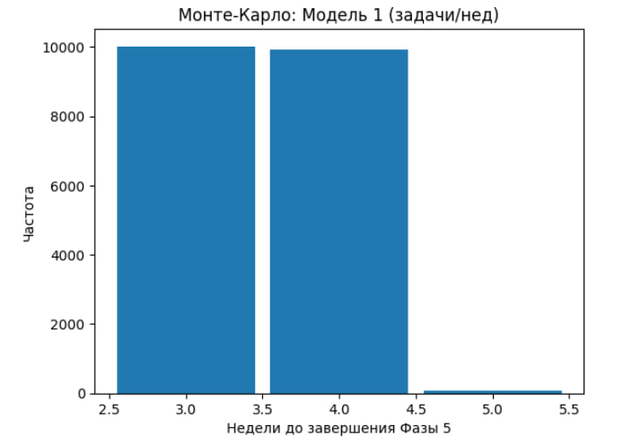
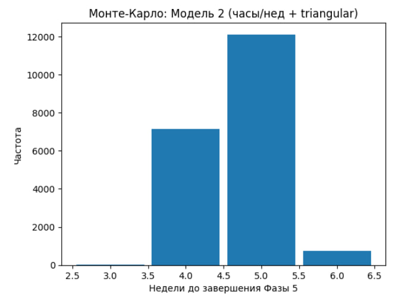

## Фаза 4

## 1. Декомпозиция работ Фазы 5 на задачи

**Цель:** разбить работы Фазы 5 (построение плана проекта: WBS, ресурсы, предшествования, запуск эвристик и т.д.) на отдельные измеримые задачи, чтобы далее:

---

| ID    | Задача |
|-------|--------|
| P5-01 | Сформировать WBS проекта (20–25 задач) |
| P5-02 | Определить роли/специализации команды |
| P5-03 | Оценить ресурсные требования задач (люди/роли) |
| P5-04 | Определить связи предшествования (predecessors) |
| P5-05 | Задать длительности задач (baseline) |
| P5-06 | Подготовить входные данные для кода (массивы/таблицы) |
| P5-07 | Проверить критические времена (early/late) и корректность графа |
| P5-08 | Запустить набор эвристик (SLK, FREE, LST, …) |
| P5-09 | Добавить N случайных решений и сравнить |
| P5-10 | Выбрать лучшее расписание и интерпретировать результат |
| P5-11 | Перевести план в 8-часовой график (40 ч/нед) |
| P5-12 | Сформировать итоговые таблицы/диаграммы плана |
| P5-13 | Обновить распределение ответственности (RACI) |
| P5-14 | Оформить выводы и текст отчёта по Фазе 5 |

---

## 2. Трёхточечные оценки времени (a / m / b) для задач Фазы 5

**Цель:** для каждой задачи Фазы 5 задать трёхточечную оценку длительности в человеко-часах:
- **a (Optimistic)** — оптимистичная оценка (если всё идёт гладко),
- **m (Most likely)** — наиболее вероятная оценка,
- **b (Pessimistic)** — пессимистичная оценка (если будут ошибки/переделки).

Оценки используются далее в **Модели 2 Монте-Карло** (треугольное распределение `triangular(a, m, b)`).

---

### Таблица трёхточечных оценок (человеко-часы)

| ID    | Задача (Фаза 5) | a (ч) | m (ч) | b (ч) |
|------|------------------|------:|------:|------:|
| P5-01 | Сформировать WBS проекта (20–25 задач) | 2 | 4 | 6 |
| P5-02 | Определить роли/специализации команды | 1 | 2 | 3 |
| P5-03 | Оценить ресурсные требования задач (люди/роли) | 3 | 5 | 8 |
| P5-04 | Определить связи предшествования (predecessors) | 3 | 5 | 7 |
| P5-05 | Задать длительности задач (baseline) | 2 | 4 | 6 |
| P5-06 | Подготовить входные данные для кода (массивы/таблицы) | 2 | 3 | 5 |
| P5-07 | Проверка критических времён (early/late) и корректности графа | 2 | 3 | 5 |
| P5-08 | Запустить набор эвристик (SLK, FREE, LST, …) | 2 | 4 | 6 |
| P5-09 | Добавить N случайных решений и сравнить | 2 | 3 | 5 |
| P5-10 | Выбрать лучшее расписание и интерпретировать результат | 2 | 4 | 6 |
| P5-11 | Перевести план в 8-часовой график (40 ч/нед) | 2 | 3 | 5 |
| P5-12 | Сформировать итоговые таблицы/диаграммы плана | 2 | 4 | 6 |
| P5-13 | Обновить распределение ответственности (RACI) | 1 | 2 | 3 |
| P5-14 | Оформить выводы и текст отчёта по Фазе 5 | 2 | 4 | 7 |

---

### Контрольные суммы (для наглядности)

- Σ **a** (optimistic) = **28 ч**
- Σ **m** (most likely) = **50 ч**
- Σ **b** (pessimistic) = **78 ч**

Для ознакомление с таблицей посетите [phase4_forecasting_finmate](https://1drv.ms/x/c/7d74f1ca817b07c9/IQDB_4JoxYk4R7ChHvZKwKcLAVIIEPKwN1Pn6NpYvme6vQQ?e=QPV3WY)

## 3. Прогноз сроков выполнения Фазы 5 методом Монте-Карло (2 модели)

**Цель:** на основе истории выполнения предыдущих работ спрогнозировать срок выполнения **Фазы 5** (в неделях) методом Монте-Карло двумя способами и сравнить результаты.

С кодом программы на Python можно ознакомиться по ссылка - [Python Models](https://colab.research.google.com/drive/11G-ObzHxVnWG2TAfRKfueyL03xFiWwFw?usp=sharing)

---

### 3.1 Модель 1 — дискретное распределение «задачи/неделя»

**Модель 1 (задачи/нед):**  

**Интерпретация графика (Модель 1).**  
По гистограмме видно, что основная масса прогонов завершает Фазу 5 примерно за **3–4 недели**, редко встречаются более длинные сроки (правый «хвост»).  
Это объясняется тем, что модель 1 оценивает прогресс только **по количеству задач**, считая их условно равными по трудоёмкости.

---

### 3.2 Модель 2 — дискретное распределение «часы/неделя» + triangular(a, m, b)

**Модель 2 (часы/нед + triangular):**  

**Интерпретация графика (Модель 2).**  
Гистограмма для модели 2 смещена вправо и имеет больший разброс: основной диапазон — около **4–5 недель**, а правый хвост может доходить примерно до **6 недель**.  
Это ожидаемо, потому что модель 2 учитывает:
- недельную вариативность загрузки команды (в разные недели разное число часов),
- неодинаковый размер задач (распределение `triangular(a,m,b)`),
- «неудачные» сочетания (низкая неделя по часам + задачи ближе к pessimistic).

---

### 3.3. Сравнение результатов двух моделей

- **Модель 1** обычно даёт более оптимистичный прогноз, так как опирается только на «сколько задач закрываем в неделю» и не различает большие и маленькие задачи.
- **Модель 2** даёт более консервативный и реалистичный прогноз, так как учитывает:
  - реальную доступную мощность по неделям (часы/нед),
  - вариативность длительности задач (a/m/b).

Различия между моделями объясняются их допущениями:

1) **Модель 1 (задачи/нед)** считает, что задачи примерно одинаковы по трудоёмкости и измеряет прогресс “штуками”.
   На практике задачи неоднородны: часть задач требует больше времени на проверку, отладку и оформление, поэтому модель 1
   может давать более оптимистичную оценку.

2) **Модель 2 (часы/нед + triangular)** учитывает две ключевые реальности:
   - **неравномерную загрузку команды по неделям** (в разные недели получается выделить разное количество часов),
   - **вариативность длительности задач** через трёхточечные оценки `a/m/b` (часть задач “распухает” из-за ошибок,
     уточнений требований или дополнительных проверок).

3) Из-за этого у модели 2 распределение сроков обычно **шире** и имеет более выраженный **правый хвост**:
   иногда совпадают “плохие недели” по времени и задачи, попавшие ближе к пессимистичной оценке `b`,
   что увеличивает итоговый срок. Поэтому модель 2 чаще получается более консервативной и ближе к реальности.

---

### Фаза 4 - выводы.

Для планового срока рекомендуется ориентироваться на оценку **P80** и брать более надёжную, консервативную оценку — как правило **P80 модели 2** (или максимум из P80 двух моделей).  
Это обеспечивает план с запасом на вариативность загрузки и неопределённость длительностей задач, снижая риск срыва срока выполнения Фазы 5.
